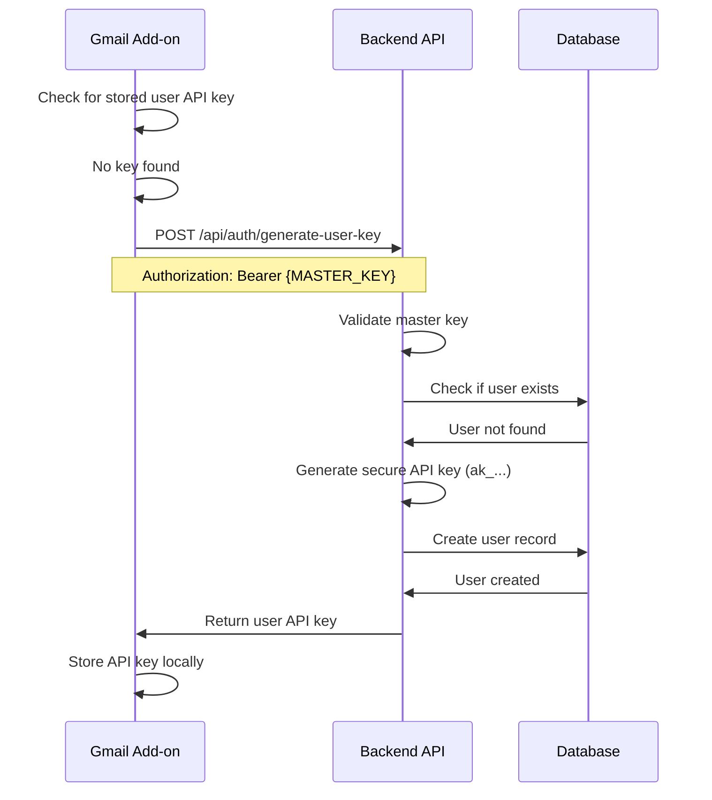
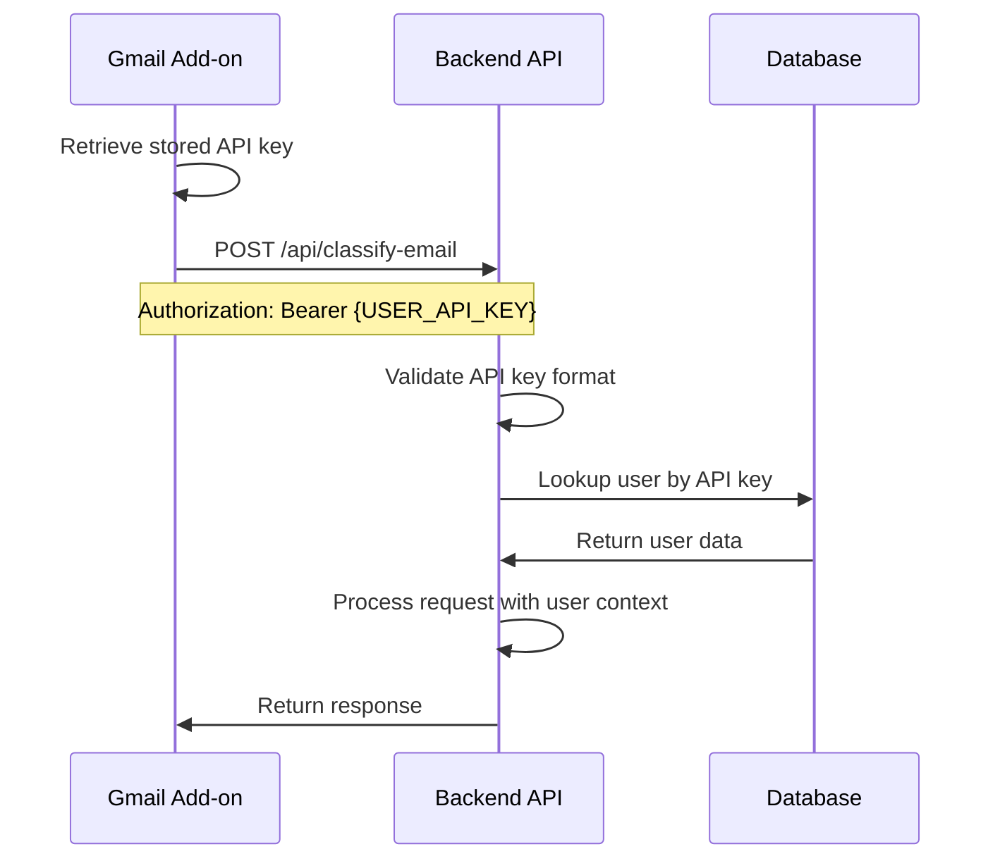
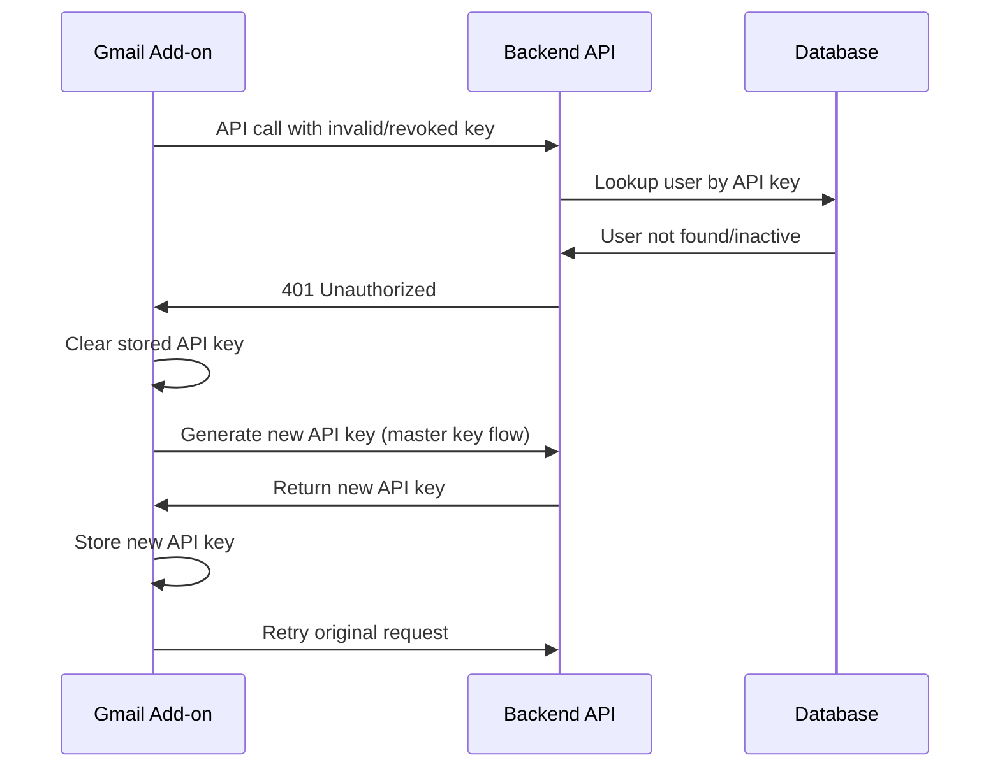

# API Authentication Flow Documentation

## Overview

The two-tier API key authentication system provides zero-friction user experience while maintaining individual user security through a master key and individual user API keys.

## Authentication Tiers

### Tier 1: Master API Key
- **Purpose**: Generate individual user API keys
- **Scope**: Limited to `/api/auth/generate-user-key` endpoint
- **Format**: Any secure string (recommend 32+ characters)
- **Storage**: Environment variable `MASTER_API_KEY`
- **Rotation**: Can be rotated without affecting existing users

### Tier 2: User API Keys
- **Purpose**: All application functionality
- **Scope**: All protected endpoints except user generation
- **Format**: `ak_[64-character-hex]` (67 characters total)
- **Storage**: Database `users.api_key` column
- **Lifecycle**: Generated once per user, can be revoked individually

## Authentication Flow

### 1. Initial User Setup (Gmail Add-on)



### 2. Subsequent API Calls



### 3. API Key Validation Failure



## API Endpoints

### Authentication Endpoints

#### Generate User API Key
```http
POST /api/auth/generate-user-key
Authorization: Bearer {MASTER_API_KEY}
Content-Type: application/json

{
  "email": "user@example.com",
  "name": "User Name" // optional
}
```

**Response:**
```json
{
  "success": true,
  "api_key": "ak_1234567890abcdef...",
  "user_id": "uuid",
  "created": true,
  "message": "New user created"
}
```

#### Validate User API Key
```http
POST /api/auth/validate-user-key
Content-Type: application/json

{
  "api_key": "ak_1234567890abcdef..."
}
```

**Response:**
```json
{
  "valid": true,
  "user": {
    "id": "uuid",
    "email": "user@example.com",
    "name": "User Name",
    "created_at": "2024-01-01T00:00:00Z"
  }
}
```

#### Get User Profile
```http
GET /api/auth/profile
Authorization: Bearer {USER_API_KEY}
```

**Response:**
```json
{
  "user": {
    "id": "uuid",
    "email": "user@example.com",
    "name": "User Name",
    "source": "gmail_addon",
    "created_at": "2024-01-01T00:00:00Z",
    "updated_at": "2024-01-01T00:00:00Z"
  }
}
```

#### Revoke User API Key
```http
POST /api/auth/revoke-user-key
Content-Type: application/json

{
  "api_key": "ak_1234567890abcdef..."
}
```

**Response:**
```json
{
  "success": true,
  "message": "API key revoked successfully",
  "user_id": "uuid"
}
```

### Protected Endpoints

All other API endpoints require user API key authentication:

```http
Authorization: Bearer {USER_API_KEY}
```

Available endpoints:
- `POST /api/classify-email`
- `POST /api/parse-receipt`
- `GET /api/receipts`
- `GET /api/travel`
- `GET /api/job-applications`

## Security Features

### API Key Generation
- Uses Node.js `crypto.randomBytes(32)` for secure randomness
- 256-bit entropy (64 hex characters)
- Prefixed with `ak_` for easy identification
- Stored as unique constraint in database

### Validation
- Master key validation for user generation only
- User API key format validation (`ak_` prefix, 67 characters)
- Database lookup with active status check
- Automatic key regeneration on validation failure

### Access Control
- Master key: Limited to user generation endpoint
- User keys: Access to all functionality except user generation
- Individual user isolation (users can only access their own data)
- Audit trail through user association

### Error Handling
- Invalid keys return 401 Unauthorized
- Missing keys return 401 Unauthorized
- Malformed requests return 400 Bad Request
- Server errors return 500 Internal Server Error

## Environment Variables

Required environment variables:

```bash
# Master API Key (for user generation)
MASTER_API_KEY=your_secure_master_key_here

# Supabase Configuration
SUPABASE_URL=https://your-project.supabase.co
SUPABASE_SERVICE_ROLE_KEY=your_service_role_key

# OpenAI Configuration
OPENAI_API_KEY=your_openai_api_key
```

## Database Schema

The `users` table stores user API keys:

```sql
CREATE TABLE users (
  id UUID PRIMARY KEY DEFAULT gen_random_uuid(),
  email TEXT UNIQUE NOT NULL,
  api_key TEXT UNIQUE NOT NULL,
  name TEXT,
  is_active BOOLEAN DEFAULT true,
  source TEXT DEFAULT 'gmail_addon',
  created_at TIMESTAMPTZ DEFAULT now(),
  updated_at TIMESTAMPTZ DEFAULT now()
);
```

## Monitoring and Logging

### Recommended Logging
- User API key generation events
- Authentication failures
- API key validation attempts
- User deactivation events

### Metrics to Track
- Active user count
- API key generation rate
- Authentication failure rate
- Endpoint usage by user

## Best Practices

### For Gmail Add-on
1. Always validate stored API keys before use
2. Implement automatic key regeneration on 401 errors
3. Store keys securely using `PropertiesService.getUserProperties()`
4. Handle network failures gracefully

### For Backend API
1. Rotate master API key regularly
2. Monitor for unusual authentication patterns
3. Implement rate limiting per user
4. Log security events for audit

### For Production Deployment
1. Use strong master API key (32+ characters)
2. Enable HTTPS only
3. Set up monitoring alerts
4. Regular security audits
5. Backup user data regularly

## Troubleshooting

### Common Issues

**User API key not working:**
- Check if user is active in database
- Verify API key format (starts with `ak_`, 67 characters)
- Check for typos in stored key

**Master key authentication failing:**
- Verify environment variable is set correctly
- Check for whitespace in key
- Ensure using correct endpoint

**Gmail add-on not generating keys:**
- Check script properties configuration
- Verify network connectivity
- Check Apps Script execution logs

### Debug Endpoints

Health check (no authentication):
```http
GET /api/health
```

Response:
```json
{
  "status": "healthy",
  "timestamp": "2024-01-01T00:00:00Z",
  "version": "1.0.0"
}
```